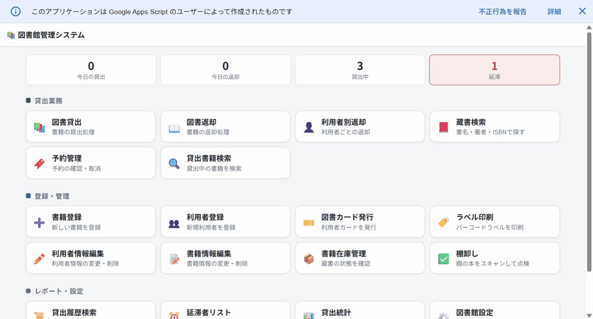
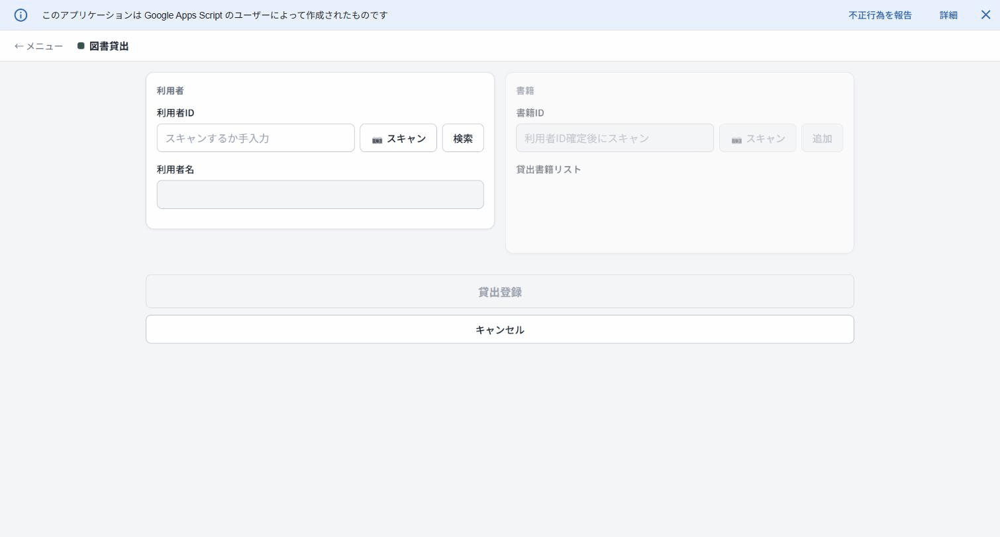
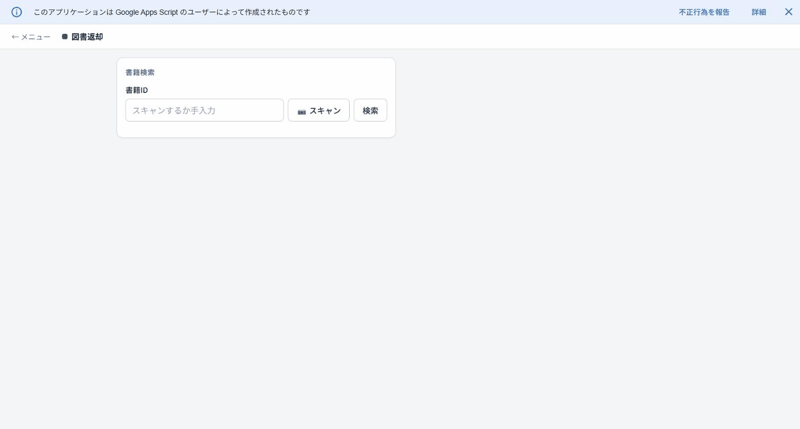
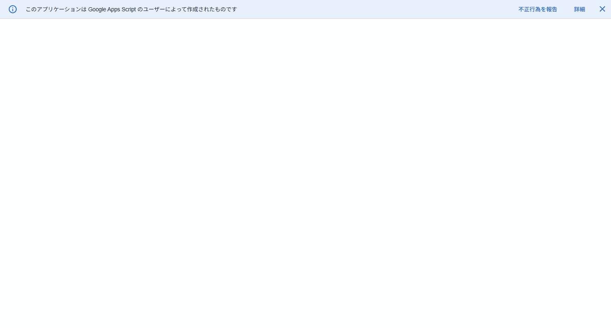
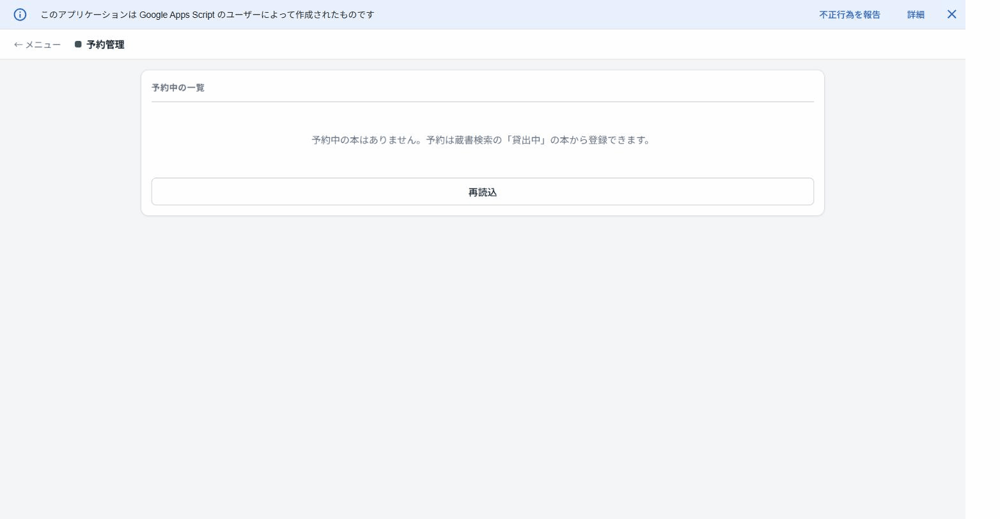
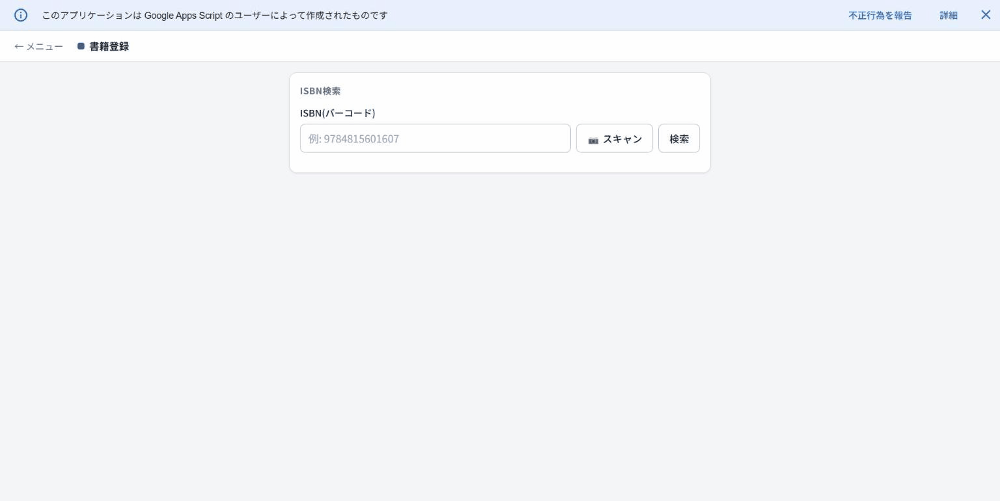
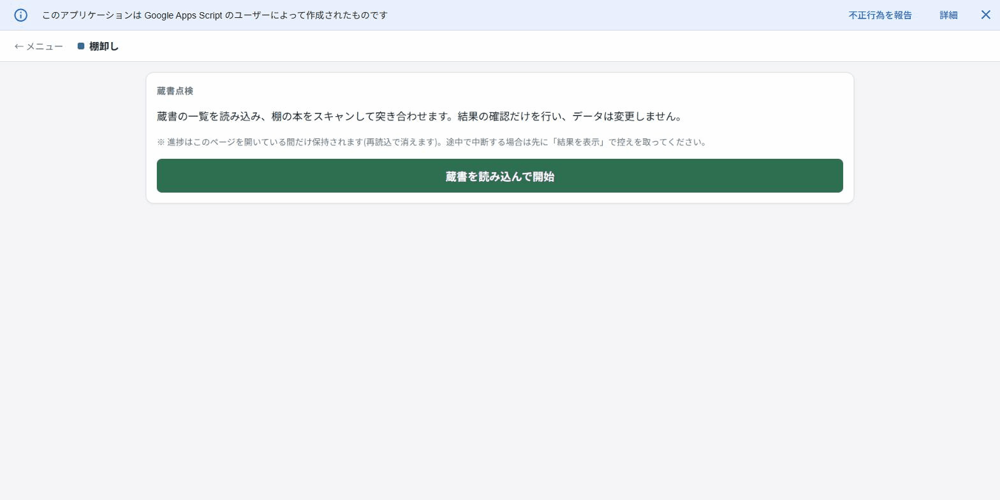

# lite-library 📚

Google Apps Script(GAS)+ Googleスプレッドシートで動く、小規模図書館向けの蔵書・貸出管理システムです。サーバー不要・追加費用なしで、スマホ/iPad/PCのブラウザから使えます。



## 特徴

- **バーコード運用が前提** — 書籍・利用者カードのバーコードをカメラでスキャンして貸出・返却(手入力も可)
- **貸出・返却・延長・予約(取り置き)・棚卸し**まで一通りの図書館業務をカバー
- **メール通知** — 返却期限前リマインダー・延滞通知・予約の入荷案内を自動送信
- **データはすべてスプレッドシート** — 特別なDBは不要。バックアップ・集計も普段のスプレッドシート操作でできる
- **スマホ最適化UI** — カウンターでも書架でも片手で操作できる

## 仕組み

- コンテナバインド型のGASウェブアプリです。スプレッドシートがデータベースになり、次のシートを使います:
  - `書籍DB`(蔵書。1行=1冊、管理番号で識別)/ `利用者DB` / `貸出記録` / `設定DB` / `予約DB`(予約機能を初めて使ったとき自動作成)
- アクセスは Google Workspace ドメイン内アカウントに限定されます(利用者情報の保護のため)。

## セットアップ

1. スプレッドシートを新規作成し、拡張機能 → Apps Script でプロジェクトを作成(または [clasp](https://github.com/google/clasp) で `.clasp.json` にスクリプトIDを設定して `clasp push`)。
2. Apps Script エディタから `setupLibrarySystem` を一度実行(必要なシートとヘッダーを自動作成。既存データには触れません)。
   - スプレッドシートの「管理メニュー」に出したい場合は `コード.js` の `onOpen` 内のコメントアウトを外します。
3. デプロイ → 新しいデプロイ → 種類「ウェブアプリ」で公開(実行ユーザー: 自分 / アクセス: ドメイン内)。
4. 発行されたURLを開くとメニューが表示されます。
5. スプレッドシートを開き直し、**管理メニュー →「トリガー一括設置」** を実行すると、延滞通知(毎日9時)・返却リマインダー(毎日10時)・月次アーカイブ(毎月1日)が自動化されます。

```sh
# 開発コマンド
clasp push              # ローカル → Apps Script へアップロード
clasp deploy            # 新しいデプロイを作成
node --check コード.js   # ローカルでの構文チェック
```

## 使い方

### 図書貸出



1. 利用者カードのバーコードを「📷 スキャン」で読み取る(または利用者IDを入力して「検索」)
2. 利用者名が表示されたら、貸す本のバーコードを連続スキャン(右側のリストに追加されていく)
3. 「貸出登録」を押して完了

- 一人あたりの貸出冊数上限(設定)を超える貸出は自動でブロックされます。
- 他の利用者が予約している本は貸し出せません(予約者本人には貸せて、予約は自動で消込)。

### 図書返却



1. 返ってきた本のバーコードをスキャン(または書籍IDを入力して「検索」)
2. 該当する貸出が表示されるので、チェックして「まとめて返却」

- 返却した本に予約が入っている場合、**「⚠ ○○さんが予約中です。取り置きしてください」** と表示され、予約者へ入荷メールが自動送信されます。

### 利用者別返却・貸出延長

「利用者別返却」では利用者IDから未返却の本を一覧表示し、まとめて返却できます。各行の**「延長」ボタン**で返却期限を延長できます(新しい期限 = 現在の期限+貸出期間)。

- 延長回数の上限は設定で変更できます(0で延長禁止)。
- 延滞中の本、予約が入っている本は延長できません。

### 蔵書検索・予約



書名・著者名・ISBN・管理番号の一部を入力して検索すると、在庫状況(在庫/貸出中/取り置き中)と返却予定日が分かります。バーコードスキャンで即検索も可能です。

- **貸出中・取り置き中の本には「予約」ボタン**が表示され、利用者IDを入力すると予約キューに並べます。
- 在庫がある本は予約できません(そのまま貸出を案内)。



「予約管理」ページで予約中・取り置き中の一覧確認と取消ができます。取り置き中の予約を取り消すと、空いた本は自動的に次の予約者へ引き継がれます。

### 書籍登録



1. 本の裏表紙のISBNバーコードをスキャン(または入力して「検索」)
2. 書誌情報(書名・著者・出版社)が自動取得されるので確認し、冊数を指定して登録
3. 登録すると管理番号(コピーごとに一意)が発行されます。「ラベル印刷」で管理番号バーコードのラベルを印刷して本に貼ってください

書誌情報は openBD → Google Books API の順で自動取得します。

### 利用者登録・カード発行

「利用者登録」で氏名・メールアドレス等を登録すると利用者IDが発行されます(メール通知に使うためアドレスの登録を推奨)。「図書カード発行」でバーコード付きの利用者カードを印刷できます。

### 棚卸し(蔵書点検)



1. 「蔵書を読み込んで開始」を押す
2. 棚の本を片っ端からスキャン — 進捗(棚にあるはず/スキャン済/未スキャン)が更新されます
3. 蔵書DBに無い本や「貸出中のはずが棚にある本」はその場で警告表示
4. 「結果を表示」で**在庫のはずがスキャンされなかった本(行方不明疑い)**の一覧を確認

データは一切変更しないので、何度でも安全に実行できます。進捗はページを開いている間だけ保持されます。

### レポート

- **貸出履歴検索** — 期間・利用者・書籍で過去の貸出を検索、レポートシート出力も可能
- **延滞者リスト** — 延滞中の貸出を一覧表示
- **貸出統計** — 期間別の貸出数・人気書籍・利用者ランキング

### 図書館設定


貸出期間(日数)、一人あたりの最大貸出冊数、貸出延長の上限回数、返却リマインダーの送信タイミング、メール通知のオン/オフ、図書館名などをブラウザから変更できます。

## メール通知

| 通知 | タイミング | 条件 |
|---|---|---|
| 返却リマインダー | 毎日10時(トリガー) | 返却期限がN日以内の未返却(1貸出1回) |
| 延滞通知 | 毎日9時(トリガー) | 期限超過。再送間隔は設定可能 |
| 予約の入荷案内 | 返却・取消の処理時 | 予約中の本が用意できたとき |

利用者DBにメールアドレスが登録されている利用者にのみ送信されます。文面は設定DBのテンプレート(`overdueTemplate` / `reminderTemplate`)で変更できます。

## スプレッドシートの管理メニュー

スプレッドシートを開くと「管理メニュー」が追加されます:

- **スキーマ検証** — シート構成が定義と一致しているか確認
- **状態の整合性チェック・修復** — 書籍の状態と貸出記録のずれを検出・修復
- **延滞リマインダー送信** — 延滞通知を手動送信
- **貸出状況レポート作成** — 現在の貸出状況をレポートシートに出力
- **返却済データのバックアップ** — 返却済みの記録を別スプレッドシートへ退避
- **トリガー一括設置 / 一括解除** — 自動通知・月次アーカイブのトリガーをまとめて管理

初期セットアップや書籍DBのレイアウト移行など、運用開始時のみ必要な項目は `onOpen` 内にコメントアウトで残してあります。

## ライセンス

[MIT License](LICENSE)
